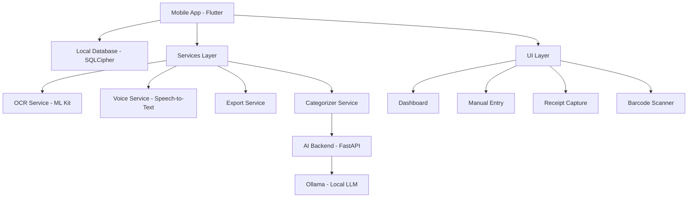

# 📱 Xubudget - Comprehensive Personal Budget Management System

<div align="center">


**A complete Flutter-based personal budget management ecosystem with AI-powered categorization, OCR receipt scanning, voice input, and local-first data storage.**

[](https://flutter.dev)
[](LICENSE)
[](https://flutter.dev/docs/development/tools/sdk/release-notes)
[](https://ollama.com)

</div>

---

## 🌟 Overview

Xubudget is a comprehensive personal finance management application designed for privacy-conscious users who want complete control over their financial data. Built with Flutter for cross-platform compatibility and powered by local AI models for intelligent expense categorization, Xubudget offers a modern, secure, and feature-rich budgeting experience.

### 🎯 Core Philosophy

- **🏠 Local-First**: All data processing happens on your device - no cloud dependencies
- **🔒 Privacy-Focused**: Encrypted storage with no data sharing or telemetry
- **🤖 AI-Enhanced**: Smart categorization using local Ollama models
- **📱 Cross-Platform**: Single codebase for Android, iOS, Windows, and Web
- **⚡ Performance**: Optimized for speed and responsiveness

---

## ✨ Features

### 📊 Core Functionality
- **💰 Expense Tracking**: Manual entry with intelligent categorization
- **📸 OCR Receipt Scanning**: Extract data from receipt images using ML Kit
- **🎤 Voice Input**: Speech-to-text for hands-free expense entry
- **📱 Mobile Scanner**: Barcode scanning for product identification
- **📈 Dashboard Analytics**: Visual spending insights and category breakdowns
- **📤 Export Capabilities**: CSV/XLSX export with timestamp tracking

### 🛡️ Security & Privacy
- **🔐 End-to-End Encryption**: SQLCipher database encryption
- **🔑 Secure Key Management**: Flutter Secure Storage for key handling
- **🏠 Local Processing**: No data leaves your device
- **🚫 No Tracking**: Zero telemetry or analytics collection

### 🤖 AI & Machine Learning
- **🧠 Local AI Categorization**: Ollama-powered expense categorization
- **📝 PT-BR Language Support**: Optimized for Portuguese text processing
- **🔄 Fallback Systems**: Regex-based categorization when AI unavailable
- **⚡ Fast Processing**: Lightweight models for real-time performance

### 🎨 User Experience
- **🌍 Internationalization**: Full Portuguese language support
- **🎨 Modern UI**: Material Design 3 with custom theming
- **📱 Responsive Design**: Adaptive layouts for all screen sizes
- **♿ Accessibility**: Screen reader and accessibility support

---

## 🏗️ Architecture

### System Overview



### 📁 Project Structure

```
Xubudget/
├── 📱 mobile_app/                    # Flutter Mobile Application
│   ├── android/                      # Android platform files
│   ├── ios/                          # iOS platform files
│   ├── web/                          # Web platform files
│   ├── lib/                          # Dart source code
│   │   ├── 🗄️ db/                    # Database layer
│   │   │   └── database_service.dart  # SQLCipher database service
│   │   ├── 📊 models/                # Data models
│   │   │   └── expense.dart          # Expense data model
│   │   ├── 🔄 providers/             # State management
│   │   │   └── expense_provider.dart  # Expense state provider
│   │   ├── ⚙️ services/              # Business logic services
│   │   │   ├── ocr_service.dart      # OCR text extraction
│   │   │   ├── voice_service.dart    # Speech-to-text
│   │   │   ├── expense_parser.dart   # Text parsing logic
│   │   │   ├── export_service.dart   # Data export functionality
│   │   │   ├── categorizer_service.dart # AI categorization client
│   │   │   └── logging_service.dart  # Application logging
│   │   ├── 🎨 ui/                    # User interface
│   │   │   ├── budget_dashboard_page.dart    # Main dashboard
│   │   │   ├── manual_entry_page.dart       # Manual expense entry
│   │   │   ├── capture_receipt_page.dart    # Receipt scanning
│   │   │   ├── barcode_scanner_page.dart    # Barcode scanning
│   │   │   └── main_scaffold.dart           # App navigation
│   │   └── main.dart                 # Application entry point
│   ├── assets/                       # Application assets
│   │   ├── icon/                     # App icons
│   │   └── ml/                       # ML model assets
│   ├── test/                         # Test files
│   └── pubspec.yaml                  # Flutter dependencies
├── 🤖 services/                      # Backend Services
│   └── pi2_assistant/                # AI Categorization Service
│       ├── pi2_server.py             # FastAPI server
│       ├── requirements.txt          # Python dependencies
│       └── .env                      # Environment configuration
├── 📁 data/                          # Data directory
│   └── exports/                      # Export files location
├── 📚 docs/                          # Documentation
│   ├── api/                          # API documentation
│   ├── architecture/                 # Architecture guides
│   ├── setup/                        # Setup instructions
│   ├── development/                  # Development guides
│   ├── troubleshooting/              # Troubleshooting guides
│   ├── issues/                       # Issue tracking
│   └── export_readme.md              # Export documentation
├── 🚀 Scripts & Automation
│   ├── xubudget_android_run.bat      # Android app launcher
│   ├── xubudget_backend_run.bat      # Backend server launcher
│   └── ollama_install_and_pull.ps1   # Ollama setup script
└── 📋 Project Files
    ├── README.md                     # This comprehensive guide
    ├── DESKTOP_TESTING_GUIDE.md      # Desktop testing instructions
    ├── .gitignore                    # Git ignore rules
    └── .env.example                  # Environment template
```

---

## 🚀 Getting Started

### 📋 Prerequisites

#### Required Software
- **Flutter SDK**: 3.24.5+ ([Installation Guide](https://docs.flutter.dev/get-started/install))
- **Android Studio**: Latest version with Android SDK 21+
- **Git**: For version control
- **Python**: 3.8+ (for AI backend)
- **Ollama**: For local AI models ([Installation Guide](#ollama-setup))

#### Platform-Specific Requirements

##### 🤖 Android Development
- Android SDK API Level 21+
- Android NDK (for SQLCipher)
- USB Debugging enabled device or emulator

##### 🍎 iOS Development (macOS only)
- Xcode 14+
- iOS 11+ target device or simulator
- Apple Developer account (for device testing)

##### 🖥️ Windows Development
- Windows 10+ (for Windows desktop app)
- Visual Studio 2022 Community or higher
- Windows SDK

##### 🌐 Web Development
- Modern web browser (Chrome, Firefox, Safari, Edge)
- Web server for hosting (optional)

### 📦 Installation & Setup

#### 1. Clone the Repository
```bash
git clone https://github.com/marcobarreto007/Xubudget.git
cd Xubudget
```

#### 2. Mobile App Setup
```bash
cd mobile_app

# Install Flutter dependencies
flutter pub get

# Generate app icons for all platforms
dart run flutter_launcher_icons

# Verify installation
flutter doctor
```

#### 3. AI Backend Setup

##### Automatic Setup (Windows)
```powershell
# Run as Administrator
.\ollama_install_and_pull.ps1
```

##### Manual Setup
```bash
# Install Python dependencies
cd services/pi2_assistant
pip install -r requirements.txt

# Install and configure Ollama
# Visit: https://ollama.com/download
ollama pull qwen2.5:1.5b-instruct
```

#### 4. Verify Installation
```bash
# Check Flutter installation
flutter doctor -v

# Test app compilation
cd mobile_app
flutter analyze
flutter test
```

### 🏃 Running the Application

#### 📱 Mobile App

##### Quick Start (Android)
```bash
# Using the provided script
.\xubudget_android_run.bat
```

##### Manual Start
```bash
cd mobile_app

# List available devices
flutter devices

# Run on Android
flutter run -d android

# Run on iOS (macOS only)
flutter run -d ios

# Run on Windows desktop
flutter run -d windows

# Run on web
flutter run -d web-server --web-port 8080
```

#### 🤖 AI Backend

##### Quick Start
```bash
# Using the provided script
.\xubudget_backend_run.bat
```

##### Manual Start
```bash
cd services/pi2_assistant

# Start the FastAPI server
python -m uvicorn pi2_server:app --host 0.0.0.0 --port 5001 --reload

# Alternative using Python directly
python pi2_server.py
```

##### Health Check
```bash
# Verify backend is running
curl http://localhost:5001/healthz

# Test categorization
curl -X POST http://localhost:5001/categorize \
  -H "Content-Type: application/json" \
  -d '{"text": "Almocei no restaurante por R$ 25,50"}'
```

---

## 🎯 Usage Guide

### 📊 Dashboard Overview

The main dashboard provides:
- **📈 Expense Summary**: Total spent, category breakdown
- **📋 Recent Expenses**: Latest transactions with editing options
- **📤 Export Actions**: Quick access to CSV/XLSX export
- **⚙️ Settings**: App configuration and preferences

### 💰 Adding Expenses

#### ✏️ Manual Entry
1. Tap the "➕" button on the dashboard
2. Enter expense details:
   - **Amount**: Brazilian Real format (R$ 00,00)
   - **Description**: Free text description
   - **Category**: Auto-suggested or manual selection
   - **Date**: Date picker or text input
3. Save the expense

#### 📸 Receipt Scanning
1. Navigate to "Receipt Capture" page
2. Take a photo or select from gallery
3. OCR extracts text automatically
4. Review and edit parsed data
5. Save the expense

#### 🎤 Voice Input
1. Use voice input on manual entry page
2. Speak your expense details in Portuguese
3. Review transcribed text
4. Confirm and save

#### 📱 Barcode Scanning
1. Navigate to "Barcode Scanner" page
2. Scan product barcode
3. Add price and other details
4. Save the expense

### 📂 Data Management

#### 📤 Exporting Data
1. From dashboard, tap the download icon
2. Choose format (CSV or XLSX)
3. Files saved to `data/exports/` directory
4. Access via file manager or desktop

#### 🗄️ Database Management
- Data encrypted with SQLCipher
- Automatic backups (future feature)
- Data integrity checks
- Secure key management

### 🤖 AI Categorization

The AI system automatically categorizes expenses into:
- **🍔 Alimentação**: Food, restaurants, groceries
- **🚗 Transporte**: Fuel, public transport, ride-sharing
- **🏥 Saúde**: Medical, pharmacy, health services
- **🏠 Moradia**: Rent, utilities, home maintenance
- **🎮 Lazer**: Entertainment, hobbies, travel
- **📚 Educação**: Education, books, courses
- **📦 Outros**: Miscellaneous expenses

---

## 🔧 Development

### 🏗️ Architecture Patterns

#### 🎯 State Management
- **Provider Pattern**: Used for expense state management
- **Singleton Services**: Database and utility services
- **Repository Pattern**: Data access abstraction

#### 🗄️ Database Design
```sql
CREATE TABLE expenses (
    id INTEGER PRIMARY KEY AUTOINCREMENT,
    description TEXT NOT NULL,
    amount REAL NOT NULL,
    category TEXT NOT NULL,
    date TEXT NOT NULL,
    source TEXT NOT NULL,
    receiptImageHash TEXT,
    createdAt TEXT NOT NULL
);
```

#### 🌐 API Design
```yaml
# AI Categorization API
POST /categorize:
  request:
    text: string
  response:
    category: string
    confidence: float
    method: "ai" | "regex"
    description?: string
    amount?: float

GET /healthz:
  response:
    status: "healthy"
    service: "xubudget-categorizer"
```

### 🧪 Testing Strategy

#### 📱 Flutter Testing
```bash
# Run all tests
flutter test

# Run with coverage
flutter test --coverage

# Widget tests
flutter test test/widget_test.dart

# Integration tests
flutter drive --target=test_driver/app.dart
```

#### 🤖 Backend Testing
```bash
cd services/pi2_assistant

# Install test dependencies
pip install pytest httpx

# Run tests
pytest test_server.py -v

# Run with coverage
pytest --cov=pi2_server test_server.py
```

### 📦 Building for Production

#### 📱 Mobile Builds

##### Android APK
```bash
cd mobile_app

# Build debug APK
flutter build apk --debug

# Build release APK
flutter build apk --release

# Build App Bundle (for Play Store)
flutter build appbundle --release
```

##### iOS IPA (macOS only)
```bash
# Build for iOS
flutter build ios --release

# Archive for App Store
flutter build ipa --release
```

##### Windows Executable
```bash
# Build Windows desktop app
flutter build windows --release
```

##### Web Application
```bash
# Build web app
flutter build web --release

# Deploy to web server
cp -r build/web/* /var/www/html/
```

#### 🤖 Backend Deployment
```bash
cd services/pi2_assistant

# Create Docker container
docker build -t xubudget-backend .

# Run container
docker run -p 5001:5001 xubudget-backend

# Deploy with Docker Compose
docker-compose up -d
```

### 🔄 CI/CD Pipeline

The project includes GitHub Actions workflows:

#### 📱 Mobile CI (.github/workflows/android_build.yml)
- Code quality checks (`flutter analyze`)
- Unit test execution (`flutter test`)
- Debug APK building
- Artifact upload for download

#### 🤖 Backend CI (Future)
- Python code quality (flake8, black)
- Unit test execution (pytest)
- Docker image building
- Security scanning

---

## 🔧 Configuration

### 📱 Mobile App Configuration

#### pubspec.yaml Key Dependencies
```yaml
dependencies:
  flutter_riverpod: 2.5.1          # State management
  google_mlkit_text_recognition: 0.11.0  # OCR
  image_picker: 1.0.7              # Camera/gallery
  sqflite_sqlcipher: 3.3.0         # Encrypted database
  flutter_secure_storage: 8.1.0    # Secure key storage
  speech_to_text: 6.3.0            # Voice input
  mobile_scanner: 7.0.1            # Barcode scanning
  csv: 5.1.1                       # CSV export
  intl: 0.19.0                     # Internationalization
```

#### App Icons Configuration
```yaml
flutter_launcher_icons:
  android: true
  ios: true
  image_path: "assets/icon/app_icon.png"
  min_sdk_android: 21
  web:
    generate: true
    background_color: "#121212"
    theme_color: "#6C4DD6"
```

### 🤖 Backend Configuration

#### Environment Variables (.env)
```bash
# Ollama Configuration
OLLAMA_URL=http://127.0.0.1:11434
MODEL_NAME=qwen2.5:1.5b-instruct
REQUEST_TIMEOUT=5

# Server Configuration
HOST=0.0.0.0
PORT=5001
DEBUG=true

# Security
API_KEY=your-api-key-here
CORS_ORIGINS=["http://localhost:*", "https://localhost:*"]
```

#### FastAPI Configuration
```python
app = FastAPI(
    title="Xubudget AI Categorizer",
    version="1.0.0",
    description="AI-powered expense categorization service",
    docs_url="/docs",
    redoc_url="/redoc"
)
```

---

## 🛠️ Advanced Features

### 🤖 AI Model Customization

#### Switching Models
```bash
# Pull different model sizes
ollama pull qwen2.5:0.5b-instruct  # Lighter, faster
ollama pull qwen2.5:3b-instruct    # More accurate
ollama pull qwen2.5:7b-instruct    # Best accuracy

# Update .env file
MODEL_NAME=qwen2.5:3b-instruct
```

#### Custom Prompts
Edit `pi2_server.py` to customize AI prompts:
```python
prompt = f"""Analise o seguinte texto de despesa brasileiro e categorize-o.
Responda apenas com JSON válido no formato especificado.

Categorias: {', '.join(CATEGORIES)}
Texto: {text}

JSON:"""
```

### 📊 Export Customization

#### Custom Export Formats
```dart
// Add new export method to ExportService
Future<String> exportToJSON(List<Expense> expenses) async {
  final exportDir = await _ensureExportDirectory();
  final timestamp = DateFormat('yyyyMMdd_HHmmss').format(DateTime.now());
  final fileName = 'expenses_$timestamp.json';
  
  final jsonData = expenses.map((e) => e.toMap()).toList();
  final jsonString = jsonEncode(jsonData);
  
  final file = File(path.join(exportDir.path, fileName));
  await file.writeAsString(jsonString);
  
  return file.path;
}
```

#### Filtered Exports
```dart
// Export by date range
Future<String> exportByDateRange(
  DateTime startDate, 
  DateTime endDate
) async {
  final filteredExpenses = expenses.where((expense) =>
    expense.date.isAfter(startDate) && 
    expense.date.isBefore(endDate)
  ).toList();
  
  return exportToCSV(filteredExpenses);
}
```

### 🎨 UI Customization

#### Theme Customization
```dart
// lib/theme/app_theme.dart
class AppTheme {
  static ThemeData get lightTheme => ThemeData(
    primarySwatch: Colors.deepPurple,
    colorScheme: ColorScheme.fromSeed(
      seedColor: const Color(0xFF6C4DD6),
      brightness: Brightness.light,
    ),
    useMaterial3: true,
  );
  
  static ThemeData get darkTheme => ThemeData(
    colorScheme: ColorScheme.fromSeed(
      seedColor: const Color(0xFF6C4DD6),
      brightness: Brightness.dark,
    ),
    useMaterial3: true,
  );
}
```

#### Localization
```dart
// lib/l10n/app_localizations.dart
class AppLocalizations {
  static const Map<String, String> ptBR = {
    'dashboard': 'Painel',
    'expenses': 'Despesas',
    'add_expense': 'Adicionar Despesa',
    'categories': 'Categorias',
    // Add more translations
  };
}
```

---

## 🔍 API Documentation

### 🤖 AI Categorization Service

#### Base URL
```
http://localhost:5001
```

#### Authentication
Currently no authentication required for local deployment.

#### Endpoints

##### Health Check
```http
GET /healthz
```

**Response:**
```json
{
  "status": "healthy",
  "service": "xubudget-categorizer"
}
```

##### Categorize Expense
```http
POST /categorize
Content-Type: application/json

{
  "text": "Almocei no restaurante ABC por R$ 25,50 hoje"
}
```

**Response:**
```json
{
  "category": "alimentacao",
  "confidence": 0.92,
  "method": "ai",
  "description": "Almocei no restaurante ABC",
  "amount": 25.50,
  "date": null
}
```

**Error Response:**
```json
{
  "detail": "Invalid input text"
}
```

#### Category Mappings

| Category | Portuguese | Keywords |
|----------|------------|----------|
| alimentacao | Alimentação | restaurante, mercado, padaria, comida |
| transporte | Transporte | uber, taxi, combustível, ônibus |
| saude | Saúde | farmácia, hospital, médico, clínica |
| moradia | Moradia | aluguel, luz, água, internet |
| lazer | Lazer | cinema, bar, viagem, hotel |
| educacao | Educação | escola, curso, livro, faculdade |
| outros | Outros | (fallback category) |

### 📱 Mobile App Services

#### Database Service
```dart
// Get all expenses
final expenses = await DatabaseService().getAllExpenses();

// Add new expense
final expense = Expense(
  description: 'Lunch',
  amount: 25.50,
  category: 'alimentacao',
  date: DateTime.now(),
  source: ExpenseSource.manual,
);
await DatabaseService().insertExpense(expense);
```

#### OCR Service
```dart
// Extract text from image
final ocrService = OCRService();
final imageFile = File('/path/to/receipt.jpg');
final extractedText = await ocrService.extractTextFromImage(imageFile);
```

#### Voice Service
```dart
// Start voice recognition
final voiceService = VoiceService();
await voiceService.initialize();

final success = await voiceService.startListening(
  onResult: (text) => print('Transcribed: $text'),
);
```

---

## 🔧 Troubleshooting

### 📱 Mobile App Issues

#### Build Failures

**Problem:** Flutter build fails with SQLCipher errors
```bash
Error: Android NDK not found
```
**Solution:**
1. Install Android NDK via Android Studio
2. Set NDK path in `local.properties`:
```properties
ndk.dir=/path/to/android/ndk
```

**Problem:** ML Kit dependencies fail on iOS
```bash
Error: ML Kit not compatible with iOS version
```
**Solution:**
1. Update iOS deployment target to 11.0+
2. Update `ios/Runner/Info.plist`:
```xml
<key>MinimumOSVersion</key>
<string>11.0</string>
```

#### Runtime Issues

**Problem:** Database encryption key not found
```dart
Error: Unable to open database, invalid key
```
**Solution:**
1. Clear app data and restart
2. Reset secure storage:
```dart
await FlutterSecureStorage().deleteAll();
```

**Problem:** OCR not working on device
```dart
Error: ML Kit not initialized
```
**Solution:**
1. Check Google Play Services is updated
2. Verify camera permissions in `AndroidManifest.xml`:
```xml
<uses-permission android:name="android.permission.CAMERA" />
```

### 🤖 Backend Issues

#### Server Startup Problems

**Problem:** Ollama connection failed
```bash
Connection refused to localhost:11434
```
**Solution:**
1. Start Ollama service:
```bash
ollama serve
```
2. Verify model is pulled:
```bash
ollama list
```

**Problem:** Python dependencies missing
```bash
ModuleNotFoundError: No module named 'fastapi'
```
**Solution:**
1. Create virtual environment:
```bash
python -m venv venv
source venv/bin/activate  # Linux/macOS
venv\Scripts\activate     # Windows
```
2. Install dependencies:
```bash
pip install -r requirements.txt
```

#### AI Model Issues

**Problem:** Model responses are inconsistent
**Solution:**
1. Lower temperature in model config:
```python
"options": {
    "temperature": 0.05,  # Lower for more consistent results
    "top_p": 0.9
}
```

**Problem:** Slow AI responses
**Solution:**
1. Use smaller model:
```bash
ollama pull qwen2.5:0.5b-instruct
```
2. Increase timeout:
```python
REQUEST_TIMEOUT = 10
```

### 🌐 Network Issues

**Problem:** Mobile app can't connect to backend
**Solution:**
1. Check firewall settings
2. Use device IP instead of localhost:
```dart
static const String _baseUrl = 'http://192.168.1.100:5001';
```

**Problem:** CORS errors in web version
**Solution:**
Add CORS middleware to FastAPI:
```python
from fastapi.middleware.cors import CORSMiddleware

app.add_middleware(
    CORSMiddleware,
    allow_origins=["*"],
    allow_methods=["*"],
    allow_headers=["*"],
)
```

### 📁 Data Issues

**Problem:** Export files not found
**Solution:**
1. Check export directory:
```dart
final exportService = ExportService();
final path = await exportService.getExportsDirectoryPath();
print('Export path: $path');
```

**Problem:** Data corruption after update
**Solution:**
1. Enable WAL mode for SQLite:
```dart
await db.execute('PRAGMA journal_mode=WAL');
```
2. Implement backup strategy:
```dart
// Regular backup to external storage
final backupPath = await exportToJSON(expenses);
```

---

## 🚀 Performance Optimization

### 📱 Mobile App Performance

#### Database Optimization
```dart
// Use indexes for better query performance
await db.execute('''
  CREATE INDEX idx_expense_date ON expenses(date);
  CREATE INDEX idx_expense_category ON expenses(category);
''');

// Use prepared statements
final stmt = await db.prepare('SELECT * FROM expenses WHERE category = ?');
final results = await stmt.select(['alimentacao']);
```

#### Memory Management
```dart
// Dispose services properly
class ExpenseService {
  void dispose() {
    ocrService.dispose();
    voiceService.dispose();
    databaseService.close();
  }
}
```

#### UI Performance
```dart
// Use ListView.builder for large lists
ListView.builder(
  itemCount: expenses.length,
  itemBuilder: (context, index) => ExpenseListItem(expenses[index]),
);

// Implement lazy loading
final pagedExpenses = expenses.skip(page * pageSize).take(pageSize);
```

### 🤖 Backend Performance

#### Caching Strategy
```python
from functools import lru_cache

@lru_cache(maxsize=100)
def categorize_with_cache(text: str) -> str:
    """Cache categorization results"""
    return _categorize_with_regex(text)
```

#### Async Processing
```python
import asyncio

async def batch_categorize(texts: List[str]) -> List[CategorizeResponse]:
    """Process multiple texts concurrently"""
    tasks = [_categorize_with_ai(text) for text in texts]
    return await asyncio.gather(*tasks)
```

#### Resource Management
```python
# Connection pooling for Ollama
import aiohttp

class OllamaClient:
    def __init__(self):
        self.session = aiohttp.ClientSession(
            timeout=aiohttp.ClientTimeout(total=5),
            connector=aiohttp.TCPConnector(limit=10)
        )
    
    async def close(self):
        await self.session.close()
```

---

## 🔒 Security Considerations

### 📱 Mobile Security

#### Data Encryption
- SQLCipher with AES-256 encryption
- Secure key storage using Flutter Secure Storage
- No plain text storage of sensitive data

#### Permissions
```xml
<!-- AndroidManifest.xml - Minimal permissions -->
<uses-permission android:name="android.permission.CAMERA" />
<uses-permission android:name="android.permission.RECORD_AUDIO" />
<uses-permission android:name="android.permission.WRITE_EXTERNAL_STORAGE" />
```

#### Code Obfuscation
```bash
# Build with obfuscation
flutter build apk --release --obfuscate --split-debug-info=debug-info/
```

### 🤖 Backend Security

#### Input Validation
```python
from pydantic import BaseModel, validator

class CategorizeRequest(BaseModel):
    text: str
    
    @validator('text')
    def text_must_be_valid(cls, v):
        if len(v) > 1000:
            raise ValueError('Text too long')
        return v.strip()
```

#### Rate Limiting
```python
from slowapi import Limiter
from slowapi.util import get_remote_address

limiter = Limiter(key_func=get_remote_address)

@app.post("/categorize")
@limiter.limit("30/minute")
async def categorize_expense(request: Request, data: CategorizeRequest):
    # Implementation
```

#### Environment Security
```bash
# Use environment variables for sensitive config
export OLLAMA_API_KEY="your-secret-key"
export DATABASE_ENCRYPTION_KEY="your-db-key"
```

---

## 🌍 Internationalization

### 📱 Mobile App Localization

#### Supported Languages
- 🇧🇷 Portuguese (Brazil) - Primary
- 🇺🇸 English - Secondary
- 🇪🇸 Spanish - Future

#### Implementation
```dart
// lib/l10n/app_localizations.dart
class AppLocalizations {
  static const LocalizationsDelegate<AppLocalizations> delegate =
      _AppLocalizationsDelegate();

  static AppLocalizations of(BuildContext context) {
    return Localizations.of(context, AppLocalizations)!;
  }

  String get dashboard => _localizedValues['dashboard']!;
  String get addExpense => _localizedValues['add_expense']!;
  
  // Add more getters
}
```

#### Currency Formatting
```dart
// lib/utils/currency_formatter.dart
class CurrencyFormatter {
  static String formatBRL(double amount) {
    return NumberFormat.currency(
      locale: 'pt_BR',
      symbol: 'R\$',
      decimalDigits: 2,
    ).format(amount);
  }
}
```

### 🤖 Backend Localization

#### Multi-language AI Prompts
```python
PROMPTS = {
    'pt_BR': """Analise o seguinte texto de despesa e categorize-o...""",
    'en_US': """Analyze the following expense text and categorize it...""",
    'es_ES': """Analiza el siguiente texto de gasto y categorízalo..."""
}

def get_prompt(text: str, locale: str = 'pt_BR') -> str:
    return PROMPTS.get(locale, PROMPTS['pt_BR']).format(text=text)
```

---

## 📈 Analytics & Insights

### 📊 Built-in Analytics

#### Expense Analytics
```dart
// lib/services/analytics_service.dart
class AnalyticsService {
  static Map<String, double> getCategoryTotals(List<Expense> expenses) {
    final totals = <String, double>{};
    for (final expense in expenses) {
      totals[expense.category] = 
          (totals[expense.category] ?? 0) + expense.amount;
    }
    return totals;
  }
  
  static double getMonthlyAverage(List<Expense> expenses) {
    // Implementation
  }
  
  static List<Expense> getTopExpenses(List<Expense> expenses, int limit) {
    // Implementation
  }
}
```

#### Spending Insights
```dart
class SpendingInsights {
  final double totalSpent;
  final String topCategory;
  final double dailyAverage;
  final List<CategoryInsight> categoryBreakdown;
  
  SpendingInsights({
    required this.totalSpent,
    required this.topCategory,
    required this.dailyAverage,
    required this.categoryBreakdown,
  });
}
```

### 📈 Future Analytics Features

#### Planned Features
- Monthly/yearly spending trends
- Budget goal tracking
- Spending predictions using ML
- Expense pattern recognition
- Receipt OCR accuracy metrics
- Category prediction confidence scores

---

## 🔮 Roadmap & Future Development

### 🎯 Short-term Goals (Next 3 months)

- [ ] **Enhanced OCR**: Improve receipt text extraction accuracy
- [ ] **Voice Commands**: Add voice-controlled expense entry
- [ ] **Dark Mode**: Complete dark theme implementation
- [ ] **Backup/Restore**: Cloud-agnostic backup system
- [ ] **Budget Goals**: Set and track spending limits
- [ ] **Advanced Export**: PDF reports, email integration

### 🚀 Medium-term Goals (3-6 months)

- [ ] **Multi-currency Support**: Handle different currencies
- [ ] **Recurring Expenses**: Automated recurring transaction tracking
- [ ] **Photo Management**: Store and manage receipt photos
- [ ] **Advanced AI**: Custom model training capabilities
- [ ] **Widget Support**: Home screen widgets for quick entry
- [ ] **Offline Sync**: Robust offline functionality

### 🌟 Long-term Vision (6+ months)

- [ ] **Family Sharing**: Multi-user expense tracking
- [ ] **Investment Tracking**: Portfolio and investment management
- [ ] **Banking Integration**: Open Banking API connections
- [ ] **Smart Notifications**: AI-powered spending alerts
- [ ] **Web Dashboard**: Comprehensive web interface
- [ ] **API Ecosystem**: Third-party integration APIs

### 🤝 Community Features

- [ ] **Open Source Plugins**: Community-developed extensions
- [ ] **Template Marketplace**: Sharing expense categories and templates
- [ ] **Localization Contributions**: Community translations
- [ ] **Model Training**: Collaborative AI model improvement

---

## 🤝 Contributing

### 📋 Contribution Guidelines

#### Getting Started
1. Fork the repository
2. Create a feature branch: `git checkout -b feature/amazing-feature`
3. Make your changes
4. Run tests: `flutter test`
5. Commit changes: `git commit -m 'Add amazing feature'`
6. Push to branch: `git push origin feature/amazing-feature`
7. Open a Pull Request

#### 📝 Code Standards

##### Dart/Flutter
```dart
// Use meaningful variable names
final List<Expense> userExpenses = await _databaseService.getExpenses();

// Add documentation comments
/// Calculates the total amount for the given category
/// 
/// [expenses] List of expenses to calculate from
/// [category] Category to filter by
/// Returns the total amount as a double
double calculateCategoryTotal(List<Expense> expenses, String category) {
  return expenses
      .where((expense) => expense.category == category)
      .fold(0.0, (sum, expense) => sum + expense.amount);
}

// Use proper error handling
try {
  final result = await riskyOperation();
  return result;
} catch (e) {
  logger.error('Operation failed: $e');
  rethrow;
}
```

##### Python
```python
# Follow PEP 8 style guide
def categorize_expense(text: str) -> CategorizeResponse:
    """Categorize expense using AI with fallback to regex.
    
    Args:
        text: The expense text to categorize
        
    Returns:
        CategorizeResponse with category and confidence
        
    Raises:
        ValueError: If text is empty or invalid
    """
    if not text.strip():
        raise ValueError("Text cannot be empty")
    
    # Implementation here
```

#### 🧪 Testing Requirements

##### Mobile Tests
```bash
# Unit tests
flutter test test/unit/

# Widget tests  
flutter test test/widget/

# Integration tests
flutter drive --target=test_driver/app.dart
```

##### Backend Tests
```bash
# Unit tests
pytest test/unit/ -v

# Integration tests
pytest test/integration/ -v

# Coverage report
pytest --cov=services --cov-report=html
```

#### 📚 Documentation

- Update README.md for new features
- Add inline code documentation
- Include usage examples
- Update API documentation

### 🐛 Bug Reports

#### Bug Report Template
```markdown
## Bug Description
Brief description of the issue

## Steps to Reproduce
1. Go to...
2. Click on...
3. See error

## Expected Behavior
What should happen

## Actual Behavior
What actually happens

## Environment
- OS: [e.g., Android 13, iOS 16, Windows 11]
- App Version: [e.g., 1.0.0]
- Device: [e.g., Samsung Galaxy S23, iPhone 14]

## Screenshots
If applicable, add screenshots

## Additional Context
Any other relevant information
```

### 💡 Feature Requests

#### Feature Request Template
```markdown
## Feature Description
Clear description of the requested feature

## Use Case
Why this feature would be useful

## Proposed Solution
How you envision this working

## Alternatives Considered
Other approaches you've thought about

## Additional Context
Any other relevant information
```

---

## 📄 License

This project is licensed under the MIT License - see the [LICENSE](LICENSE) file for details.

### 📜 Third-Party Licenses

#### Flutter Dependencies
- Flutter SDK: BSD-3-Clause License
- Provider: MIT License
- SQLCipher: BSD License
- ML Kit: Google API Terms of Service

#### Python Dependencies
- FastAPI: MIT License
- Uvicorn: BSD License
- Requests: Apache 2.0 License

#### AI Models
- Qwen2.5: Apache 2.0 License
- Ollama: MIT License

---

## 👥 Support & Community

### 📞 Getting Help

#### 📚 Documentation
- **README**: This comprehensive guide
- **API Docs**: Available at `http://localhost:5001/docs` when backend is running
- **Code Comments**: Inline documentation in source code

#### 💬 Community Support
- **GitHub Issues**: Bug reports and feature requests
- **GitHub Discussions**: General questions and community chat
- **Wiki**: Community-contributed guides and tutorials

#### 📧 Contact
- **Developer**: [@marcobarreto007](https://github.com/marcobarreto007)
- **Project**: [Xubudget Repository](https://github.com/marcobarreto007/Xubudget)

### 🌟 Acknowledgments

#### 🙏 Special Thanks
- **Flutter Team**: For the amazing cross-platform framework
- **Google ML Kit Team**: For powerful on-device ML capabilities
- **Ollama Team**: For making local LLMs accessible
- **Open Source Community**: For the countless libraries and tools

#### 🏆 Contributors
<!-- Contributors list will be auto-generated -->
Thanks to all contributors who have helped make Xubudget better!

---

## 📊 Project Statistics

### 📈 Development Metrics
- **Lines of Code**: ~5,000+ (Dart + Python)
- **Files**: 20+ source files
- **Features**: 15+ core features
- **Platforms Supported**: 4 (Android, iOS, Windows, Web)
- **Languages**: 2 (Portuguese, English)

### 🏗️ Architecture Stats
- **Services**: 8 core services
- **UI Pages**: 5 main screens
- **Database Tables**: 1 encrypted table
- **API Endpoints**: 2 REST endpoints
- **Dependencies**: 15+ Flutter packages, 5+ Python packages

---

<div align="center">

## 🎉 Thank You for Using Xubudget!

**Built with ❤️ by the Xubudget team**

[](https://github.com/marcobarreto007/Xubudget/stargazers)
[](https://github.com/marcobarreto007/Xubudget/network)
[](https://github.com/marcobarreto007/Xubudget/issues)

**[⭐ Star this repo](https://github.com/marcobarreto007/Xubudget) • [🐛 Report Bug](https://github.com/marcobarreto007/Xubudget/issues) • [💡 Request Feature](https://github.com/marcobarreto007/Xubudget/issues)**

</div>

---

*Last updated: September 2024 | Version: 1.0.0 | Made with Flutter & FastAPI*
